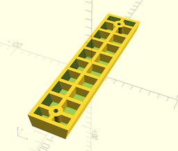
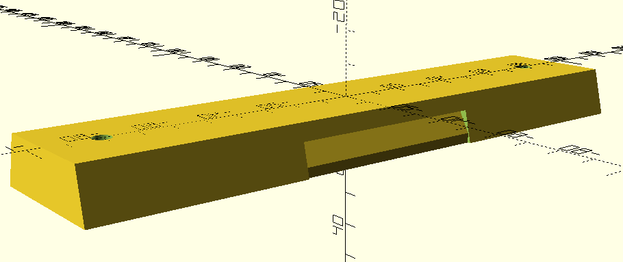

# 3D-printable components used by our DIY PVC pipe telescope design

## Models having reached `release` status / Modèles imprimés et testés

* `Adapt_oculaire_PVC.scad`: fits a 1.25" eyepiece or star diagonal into a 50mm-diameter PVC pipe / adaptateur oculaire ou renvoi coudé de 31.75mm pour tube PVC diam. 50mm

  
  
  * paramètres d'impression
      * Imprimante : Zortrax M-200 - Filament : Z-ULTRAT (diam. 1.75mm)
      * Epaisseur de couche : 0,19mm - Support : auto, 20° - Qualité : haute
      * Remplissage : 30% - Motif : 0 (maillage carré)
  * Impression
      * Durée : 1h40'
      * Filament : 6,30m / 15g
      * Prix approximatif (matériau) : 1,00€

* `vixen192_162_multi.scad` : Queue d'aronde au format VIXEN 162 ou 192 mm spécifiquement conçue pour les colliers pour tubes diamètre 63 et leurs vis de fixation murale. La version la plus courte (162 mm) peut être obtenue en configurant la variable `reduc` à `30` (mm). Le paramètre `multi_standard` contrôle la possibilité d'avoir une version multi-standards et ainsi utiliser la queue d'aronde sur une monture astronomique ou sur un pied photo (Ulanzi ou Manfrotto testés).

  
  
    
  * paramètres d'impression
      * Imprimante : Zortrax M-200 - Filament : Z-ABS (diam. 1.75mm)
      * Epaisseur de couche : 0.19mm (possible en 0.29mm) - Support : auto, 20° - Qualité : haute
      * Remplissage : 30% - Motif : 0 (maillage carré)
  * Impression
      * Durée : 5h17 pour version courte en ép. de couche 0.19mm, 3h54' pour version courte en ép. 0.29mm, 6h13' pour version longue en ép. de 0.19mm
      * Filament : 18,33m / 44g (22,34m / 53g pour la version longue initiale)
      * Prix approximatif (matériau) : 3,25€
  * En cas de warping ([cf cette page chez Zortrax](https://support.zortrax.com/troubleshooting-warping/) + autres infos collectées [ici](https://www.wevolver.com/article/abs-print-speed))
      *  augmenter la température du plateau : passer de 80°C à 85°C voire 90°C (`external materials > platform temp`) 
      *  ralentir la vitesse d'impression de la première couche (`first layer > print speed` = 50%)
      *  stopper le ventilateur (décocher `auto` et mettre 0% dans `fan speed`) 
      *  diminuer le `platform-raft gap` : de 0.2mm à 0.19mm
      

## Models still on the drawing board / Design en cours

* `Support_filtre_solaire.scad` : 2-piece design allowing the positioning of a solar filter in front of a 63mm PVC tube (60mm lens telescope) - Element en deux pièces pour maintenir un filtre solaire devant le modèle de téléscope PVC de diamètre 63mm (lentille de 60mm)

  

* `collier_lunette_diy_v2.scad`: Clamp for PVC tube with a diameter equal to 63mm to connect to a dovetail and an upper bar to fix a RIGEL kickfinder / Collier pour tube PVC diam. 63mm à relier à une queue d'aronde et une barre supèrieure pour fixer un chercheur du type kickfinder de RIGEL
  

