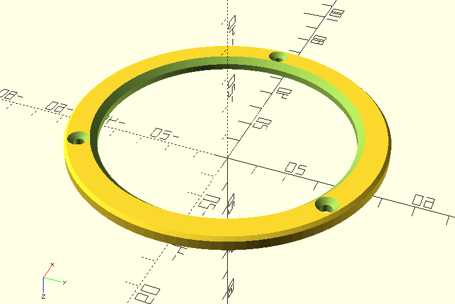

# Pièces 3D imprimables utilisées par le modèle 80 mm de notre téléscope DIY

## Modèles imprimés et testés

* `bague_focalisateur_5-PièceB.stl`: pièce B maintenant au centre du tube PVC un focalisateur avec crémaillère acueillant des oculaires de 1.25"

  
  
* `fixation_lentille_80.scad` (+ versions `.STL` prêtes à l'emploi) : deux pièces (A1 et A2) fixant la lentille à l'avant du tube

  
  
  
  * paramètres d'impression
      * Imprimante : Zortrax M-200 - Filament : Z-ULTRAT (diam. 1.75mm)
      * Epaisseur de couche : 0.19mm (possible en 0.29mm) - Support : auto, 20° - Qualité : haute
      * Remplissage : 30% - Motif : 0 (maillage carré)
  * Impression
      * Durée : 3h04 pour A1, 1h13 pour A2
      * Filament : 10,91m (26g) pour A1, 5,50m (13g) pour A2
      * Prix approximatif (matériau) : 3,50€
