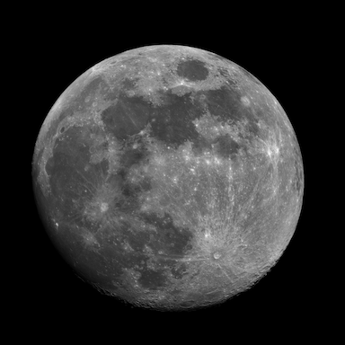

# Lunette DIY de diamètre 80mm du club du Cocher

C'est la suite de la  [lunette de 60mm imaginée par Pierre REVEL du club d'Astronomie du COCHER de La Chapelle Sur Erdre](https://www.le-cocher.org/articles.php?pg=art184). Cette version 80mm peut avoir au choix une focale de 500, 720 ou 900 mm :
- Les [pièces nécessaires à imprimer en 3D sont fournies ici](./3D-Print-Components/).
- Ls pièces A1 et A2 sont fixées entre elles via des vis M4 de longueur 12 ou 16 mm, prenant la lentille en sandwich.
- Il est possible de se procurer pour un prix modique [un renvoi coudé](https://fr.aliexpress.com/item/1005005786284500.html) et [des oculaires](https://fr.aliexpress.com/item/32788041500.html).
- Les bases de conception de cette lunette sont détaillées [dans ce document au format PDF](./CDC_Lunette_80.pdf).

L'image ci-dessous (visible en [résolution native ici](./2025-02-10-Moon_Panox2.png)) a été prise avec le modèle 80/720 sur simple pied photo/vidéo non motorisé avec une caméra astro ASI 585MC (caméra couleur non refroidie). La lune ne rentrant pas dans le champ, deux captures successives ont été réalisées pour assemblage panoramique.

* Acquisition avec FireCapture : 
  * 1000 images par vidéo, 
  * Gain à 194 & temps d'exposition de 2ms
  * Fréquence image obtenue : ~ 47 fps

* Traitement des vidéos :
  * Empilement via AutoStakkert!4 en conservant les 20% des meilleures images
  * Elimination du bruit résiduel et amélioration des détails via Registax 6
  * Assemblage des deux panneaux via Panorama Studio Pro 3
  * Conversion en noir et blanc via Nik Silver Efex
  * Recadrage et export JPEG via DxO PhotoLab

