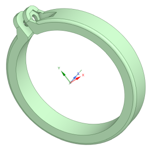

Models that can be useful to the the PVC telescope, but are not mandatory / Pièces pouvant êtres utiles pour le téléscope, mais non nécessaires pour son fonctionnement.

File with extensions .rsdocx are made using the free software DesignSpark Mechanical but STL files are also provided for ease of use / Les fichiers d'extension .rsdocx sont réalisée avec le logiciel gratuit DesignSpark Mechanical mais des fichiers STL sont également fournis pour en faciliter l'usage.

# Stop ring / Bague de butée #
This prevents the inner tube to crash into the black mask inside the outer tube ; uses an M3x8 screw + nut / Empêche le tube interne d'écraser le masque noir du tube externe ; prévoir des vis M3x8 + écrou.

# Back plug / Bouchon arrière #

# Front plug / Bouchon avant #

