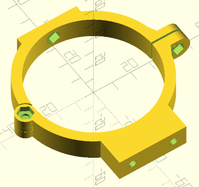
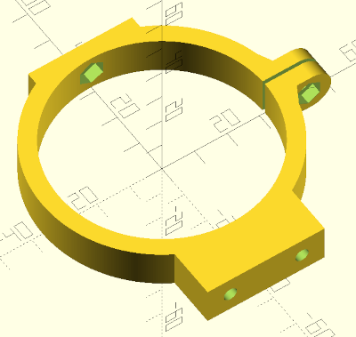

## Collier de fixation pour lunette DIY

Logiciel : OpenSCAD (gratuit)

[Lien fichier stl - collier dessous - largeur 14mm](attache_lunette_diy_v2_bas_L14.stl)

[Lien fichier stl - collier dessus - largeur 14mm](attache_lunette_diy_v2_haut_L14.stl)

[Lien fichier stl - collier complet sans rotule - largeur 12mm](collier_lunette_diy_L12.stl)

[Lien fichier source](collier_lunette_diy_v2.scad)

Il est possible d'adapter assez facilement tous les paramètres du collier à votre projet DIY.
Tous les paramètres sont au début du code source.

Ce collier est disponible en 2 versions :
1. Avec une rotule : beau mais fragile,
2. Sans rotule
Il faut juste changer la valeur du paramètre "avec_rotule" à la ligne 10 : 0 = sans rotule, 1 = avec rotule

Il est conseillé de monter les écrous M4 en chauffant avec un fer à souder. Cela évitera des cassures des pièces !