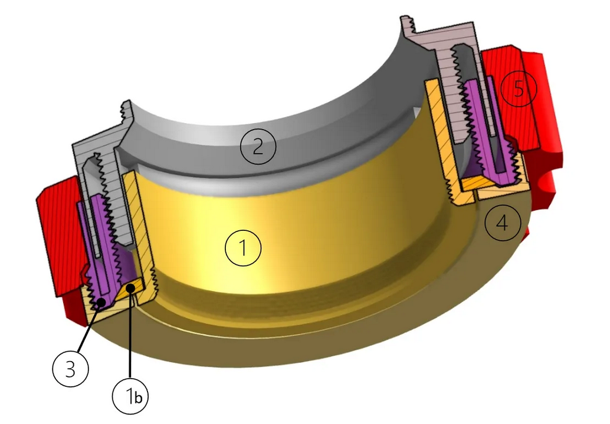

Remix Focuseur ["Non rotating helical focuser with M42 connection" de "fredgui78"](https://www.printables.com/fr/model/347950-non-rotating-helical-focuser-with-m42-connection)

Ici on propose un Focuseur basé sur un design original de "fregui78" sur le site "Printables". L'impression et son montage sont réservés à des utilisateurs avertis ; à noter que la durée et la complexité de l'impression 3D ne justifie pas forcément l'effort si on a accès à des pièces de meilleur qualité en provenance de Chine...

> Le design original étant basé sur des bagues M42, des adaptateurs sont proposés ici avec leur code source pour utiliser avec la Lunette du COCHER.
> Par ailleurs, la pièce "2" s'étant avérée très difficile à imprimer (paroie externe trop fine) cette pièce est proposée en 2 versions : originale (à utiliser avec un adaptateur M42 femelle) ou une version modifiée (sans la paroie externe et avec l'adaptateur intégré vers le tube interne de la lunette, ce qui évite d'imprimer 2 pièces et diminue légèrement la logueur du focuseur)

Il est donc conseillé, pour chaque focuseur, d'imprimer les pièces suivantes, avec une résolution optimale de .14mm par couche, si possible en ABS noir pour éviter les réflexions :
- Focuser-1.stl
- Focuser-1bis.stl
- Focuser-2(remix_LeCocher).stl  (ou Focuser-2(M42).stl + adaptateur_M42_femelle_lunette_v2.stl si vous préférez)
- Focuser-3.stl
- Focuser-4.stl
- Focuser-5.stl
- adaptateur_M42_male_oculaire_v2.stl

Montage des pièces (s'inspirer du plan ci-dessous) :

1. Coller les pièces Focuser-1.stl à Focuser-1bis.stl puis les insérer dans la pièce 3 avec un peu de graisse silicone autour de la pièce 1bis pour facilier leur rotation
2. Visser et coller la pièce 4 dans la pièce 3 au dessus des pièces 1 **sans serrer : les pièces 1 doivent pouvoir tourner !**
3. Enfoncer et coller la pièce 5 sur la pièce 3
4. Graisser les rainures et le filetage de la pièce 2, l'insérer dans la pièce 3, et tourner la pièce 5 pour la faire entrer
5. Visser (et coller ?) l'adaptateur M42 male dans la pièce 1 **sans serrer ; on doit pouvoir tourner librement cette pièce indépendemment de la partie du dessus !**
