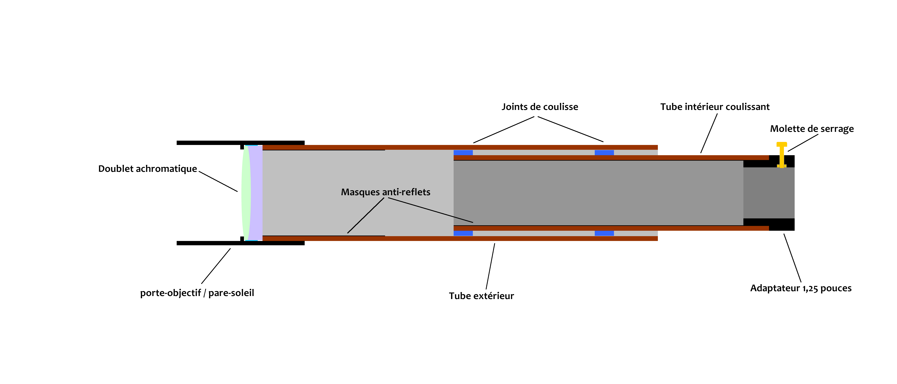
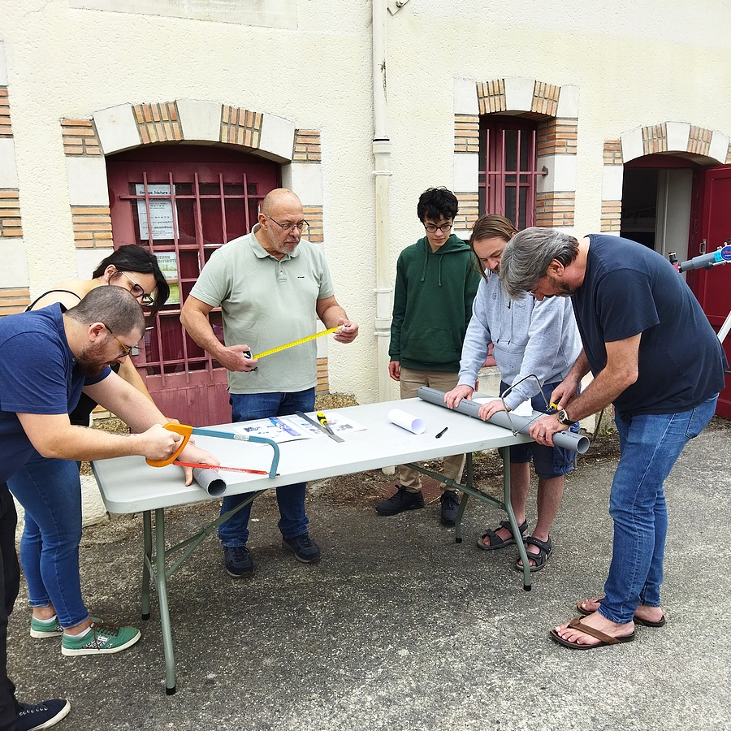
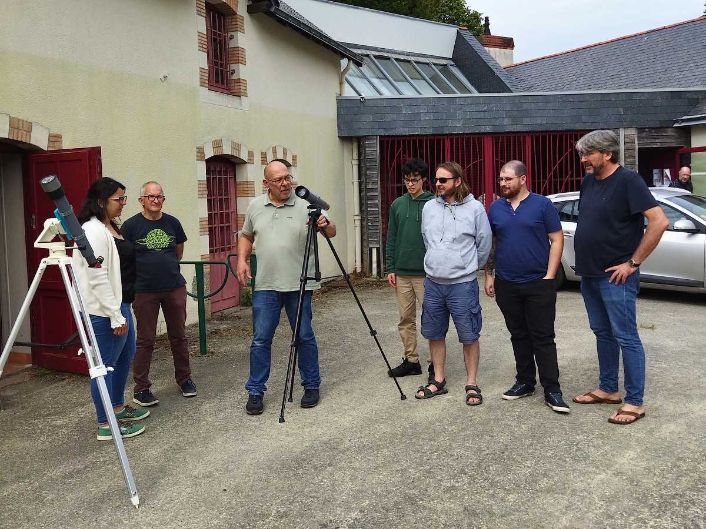

# Lunette de diamètre 60mm du club du Cocher

C'est [une petite lunette imaginée par Pierre REVEL au club d'Astronomie du COCHER de La Chapelle Sur Erdre](https://www.le-cocher.org/articles.php?pg=art184).
- Quelques [pièces nécessaires à imprimer en 3D sont fournie ici](./3D-Print-Components/).
- Des [pièces optionnelles sont disposnibles dans le dossier "Addons"](./Addons).
- Un [focuser hélicoïdal non rotatif a été spécialement adapté pour cette lunette et est disponible ici](./Focuser/).
- Il est possible d'[obtenir les lentilles nécessaires](https://fr.aliexpress.com/item/1005003785177958.html) chez AliExpress.
- Il est possible de se procurer également pour un prix modique [un renvoi coudé](https://fr.aliexpress.com/item/1005005786284500.html) et [des occulaires](https://fr.aliexpress.com/item/32788041500.html) chez le même fournisseur.

#
La lunette est facile à fabriquer [grâce au plan PDF fournit ici](./Construction_lunettes_DIY.pdf) et est disponible en diverses focales (400 / 600 / 800)

# Quelques souvenir du printemps 2024...

