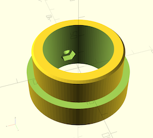
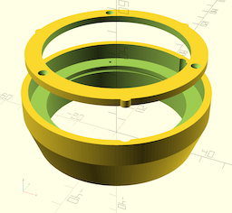

# 3D-printable components used by our DIY PVC pipe telescope design

## Models having reached `release` status / Modèles imprimés et testés

* `Adapt_oculaire_PVC.scad`: fits a 1.25" eyepiece or star diagonal into a 50mm-diameter PVC pipe / adaptateur oculaire ou renvoi coudé de 31.75mm pour tube PVC diam. 50mm

## Models still on the drawing board / Design en cours

* `Support_filtre_solaire.scad` : 2-piece design allowing the positioning of a solar filter in front of a 63mm PVC tube (60mm lens telescope) - Element en deux pièces pour maintenir un filtre solaire devant le modèle de téléscope PVC de diamètre 63mm (lentille de 60mm)

