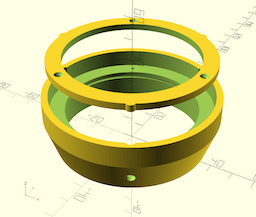

# 3D-printable components used by our DIY PVC pipe telescope design

## Models having reached `release` status / Modèles imprimés et testés

* `Adapt_oculaire_PVC.scad`: fits a 1.25" eyepiece or star diagonal into a 50mm-diameter PVC pipe / adaptateur oculaire ou renvoi coudé de 31.75mm pour tube PVC diam. 50mm

  
  
  * paramètres d'impression
      * Imprimante : Zortrax M-200 - Filament : Z-ULTRAT (diam. 1.75mm)
      * Epaisseur de couche : 0,19mm - Support : auto, 20° - Qualité : haute
      * Remplissage : 30% - Motif : 0 (maillage carré)
  * Impression
      * Durée : 1h40'
      * Filament : 6,30m / 15g
      * Prix approximatif (matériau) : 1,00€

* `vixen192.scad` : Queue d'aronde au format VIXEN 192 mm spécifiquement conçue pour les colliers pour tubes diamètre 63 et leurs vis de fixation murale

  
  
  * paramètres d'impression
      * Imprimante : Zortrax M-200 - Filament : Z-ABS (diam. 1.75mm)
      * Epaisseur de couche : 0,19mm - Support : auto, 20° - Qualité : haute
      * Remplissage : 30% - Motif : 0 (maillage carré)
  * Impression
      * Durée : 6h13'
      * Filament : 22,34m / 53g
      * Prix approximatif (matériau) : 3,25€
  * En cas de warping ([cf cette page chez Zortrax](https://support.zortrax.com/troubleshooting-warping/))
      *  diminuer le "platform gap value" : de 0.2 à 0.19mm
      *  stopper le ventilateur
      *  augmenter la température du plateau : de 80 à 85°C
      

## Models still on the drawing board / Design en cours

* `Support_filtre_solaire.scad` : 2-piece design allowing the positioning of a solar filter in front of a 63mm PVC tube (60mm lens telescope) - Element en deux pièces pour maintenir un filtre solaire devant le modèle de téléscope PVC de diamètre 63mm (lentille de 60mm)

  

