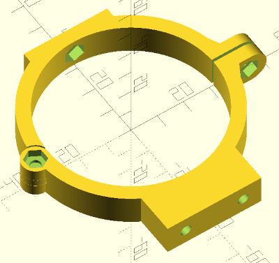

# 3D-printable components used by our DIY PVC pipe telescope design

## Models having reached `release` status / Modèles imprimés et testés

* `Adapt_oculaire_PVC.scad`: fits a 1.25" eyepiece or star diagonal into a 50mm-diameter PVC pipe / adaptateur oculaire ou renvoi coudé de 31.75mm pour tube PVC diam. 50mm

  

## Models still on the drawing board / Design en cours

* `vixen192.scad` : Queue d'aronde au format VIXEN 192 mm spécifiquement conçue pour les colliers pour tubes diamètre 63 et leurs vis de fixation murale

  

* `Support_filtre_solaire.scad` : 2-piece design allowing the positioning of a solar filter in front of a 63mm PVC tube (60mm lens telescope) - Element en deux pièces pour maintenir un filtre solaire devant le modèle de téléscope PVC de diamètre 63mm (lentille de 60mm)

  

* `collier_lunette_diy_v2.scad`: Clamp for PVC tube with a diameter equal to 63mm to connect to a dovetail and an upper bar to fix a RIGEL kickfinder / Collier pour tube PVC diam. 63mm à relier à une queue d'aronde et une barre supèrieure pour fixer un chercheur du type kickfinder de RIGEL
