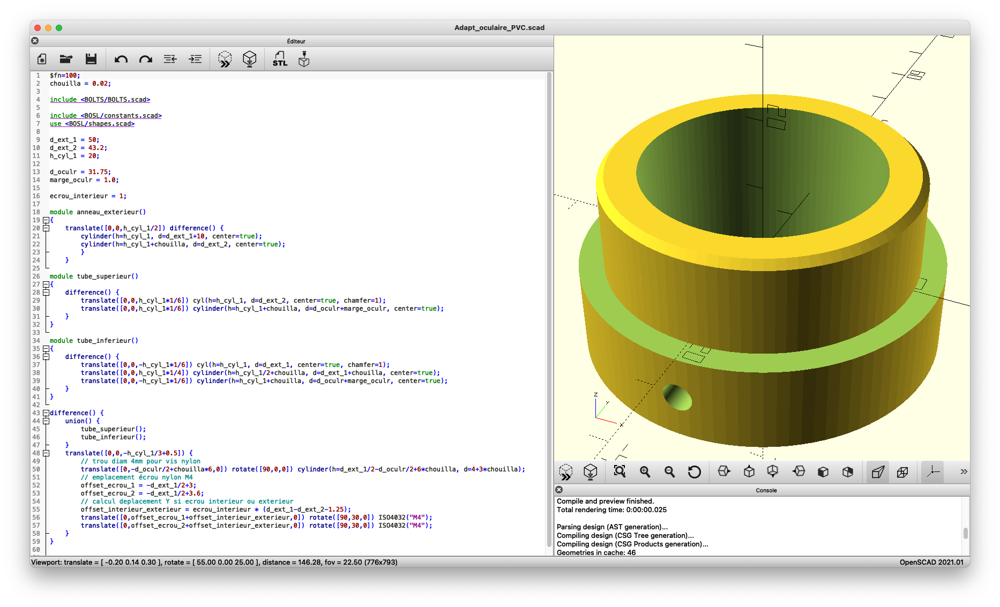

# Adapteur de diamètre 1,25" (31,75mm) pour tube PVC ø50mm

* Prérequis

  * bibliothèque OpenSCAD [BOLTS](https://boltsparts.github.io/en/index.html) installée (utilisée pour la forme d'écrou M4 avec `ISO4032("M4")`)
  * bibliothèque OpenSCAD [BOSL](https://github.com/revarbat/BOSL) installée (utilisée pour les cylindres chanfreinés avec `cyl()` remplaçant le `cylinder()` d'OpenSCAD)

* Fichier décomposant la conception étape par étape : `Exercice par étapes.scad`

* Fichier final : `Adapt_oculaire_PVC.scad`

