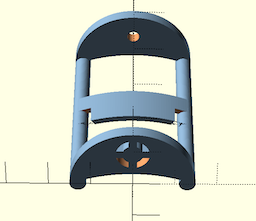

# 3D_models
3D models for astronomy - Designed preferably with OpenSCAD (to be git-compatible)

* `Live demo 2024-03-15/` contient le réducteur de diamètre 1.25" / tube PVC de 50mm et le fichier OpenSCAD décomposant la modélisation étape par étape

* `DIY PVC-based telescope (ø60)/` : dossier regroupant les différentes pièces modélisées pour le projet 2023/2024 de téléscope DIY de diamètre 60 mmm à base de tubes PVC

* `DIY PVC-based telescope (ø80)/` : dossier regroupant les différentes pièces modélisées pour le projet 2024/2025 de téléscope DIY de diamètre 80 mmm à base de tubes PVC

* `Standard-compliant adapters/`: dossier accueillant des objets individuels permettant de raccorder 'n'importe quoi' à un support standard, type queue d'aronde Vixen, platine Arcaswiss, pied photo Kodak, ... Voir les différents projets disponibles pour les adaptateurs faiant partie d'un sous-projet complet (comme la lunette DIY en tubes PVC)

* `Specific to Celestron mounts/` : dossier accueillant différents objets qui n'ont de sens que pour des montures Celestron

* `Accessories` : accessoires divers

  * Chercheur solaire à fixer sur une lunette avec un élastique (réalisé par Etienne)

    
